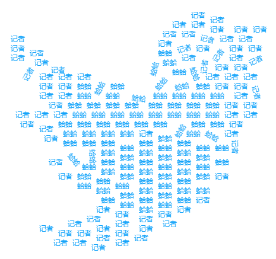

# js2wordcloud.js

[](https://travis-ci.org/liangbizhi/js2wordcloud)
[]()
[](https://opensource.org/licenses/mit-license.php)

[](https://nodei.co/npm/js2wordcloud/)



JavaScript生成词云图。基于[wordcloud2.js](https://github.com/timdream/wordcloud2.js)

由于Baidu Echarts 2的词云图在设置值较小、值相同的词语时，会出现字符重叠的问题；而又在不能使用Ecahrts 3的情况下……

wordcloud2.js能较好解决这个问题，但某些功能仍未能满足项目需求，故在此进行二次封装，做一些微小的工作。

## Installation

* 通过`script`标签引入：

```html
<script src="dist/js2wordcloud.min.js"></script>
```

* npm安装：

```bash
npm install js2wordcloud --save
```

## Usage

```javascript
var wc = new Js2WordCloud(document.getElementById('container'))
wc.setOption({
    tooltip: {
        show: true
    },
    list: [['谈笑风生', 80], ['谈笑风生', 80], ['谈笑风生', 70], ['谈笑风生', 70], ['谈笑风生', 60], ['谈笑风生', 60]],
    color: '#15a4fa'
})
```

一般用法请看`index.html`。点击[demo](http://liangbizhi.github.io/js2wordcloud)

图片形状用法请看`index-shape.html`。点击[demo](http://liangbizhi.github.io/js2wordcloud/index-shape.html)

## Features

* 支持tooltip。包括tooltip的开关和数据格式化formatter；
* 支持showLoading和hideLoading加载数据loading；
* 支持resize；
* 当词云数值相差过大时，对字体大小范围进行约束；
* 更好地支持图片形状，注意点：
    * 请使用图形为纯黑色的白底图片（格式为jpg/png）；
    * 如果形状显示不太完美，请不断调整`fontSizeFactor`, `maxFontSize`和`minFontSize`等参数；
    * 其他格式（SVG、base64等）暂不支持，请先转换为图片；

## Document

### API

* setOption(options)

    options必须通过此API进行设置，才能显示词云

    **在wordcloud2.js原options基础上增加：**

    ```javascript
    {
        // ...
        imageShape: 'https://example.com/images/shape.png',     // 提供一张图片（链接方式，仅支持jpg/png），根据其形状进行词云渲染，默认为null
        fontSizeFactor: 0.1,                                    // 当词云值相差太大，可设置此值进字体行大小微调，默认0.1
        maxFontSize: 60,                                        // 最大fontSize，用来控制weightFactor，默认60
        minFontSize: 12,                                        // 最小fontSize，用来控制weightFactor，默认12
        tooltip: {
            show: true,                                         // 默认：false
            backgroundColor: 'rgba(0, 0, 0, 0.701961)',         // 默认：'rgba(0, 0, 0, 0.701961)'
            formatter: function(item) {                         // 数据格式化函数，item为list的一项
            }
        },
        noDataLoadingOption: {                                  // 无数据提示。
            backgroundColor: '#eee',
            text: '暂无数据',
            textStyle: {
                color: '#888',
                fontSize: 14
            }
        }
        // ...
    }
    ```

* showLoading([loadingOption])

    过渡控制，显示loading（读取中）。可选。

    `loadingOption`:

    ```javascript
    {
        backgroundColor: '#eee',
        text: '正在加载...',
        effect: 'spin'                      // 默认：null, { String | Function } 可选：'spin|normal'；也可为回调函数，回调函数生成HTML
    }
    ```

* hideLoading()

    隐藏loading

* resize()

    当容器大小变化时，调用此方法进行重绘

## Licence

MIT

